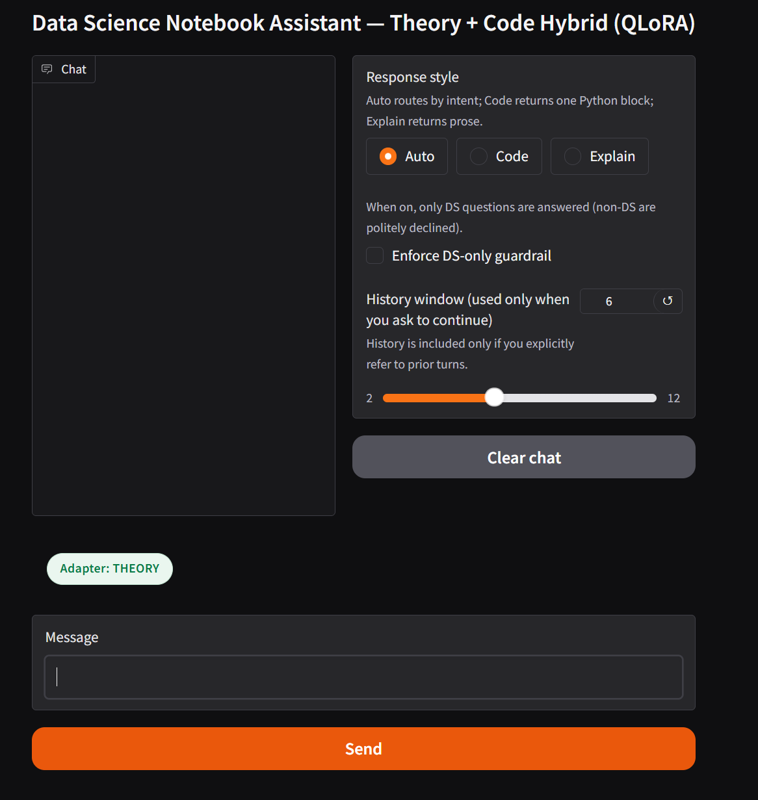
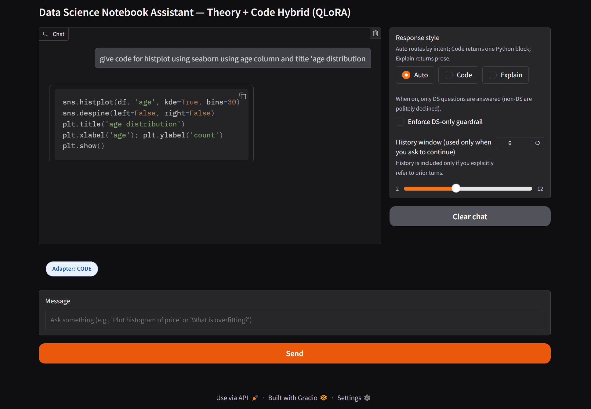
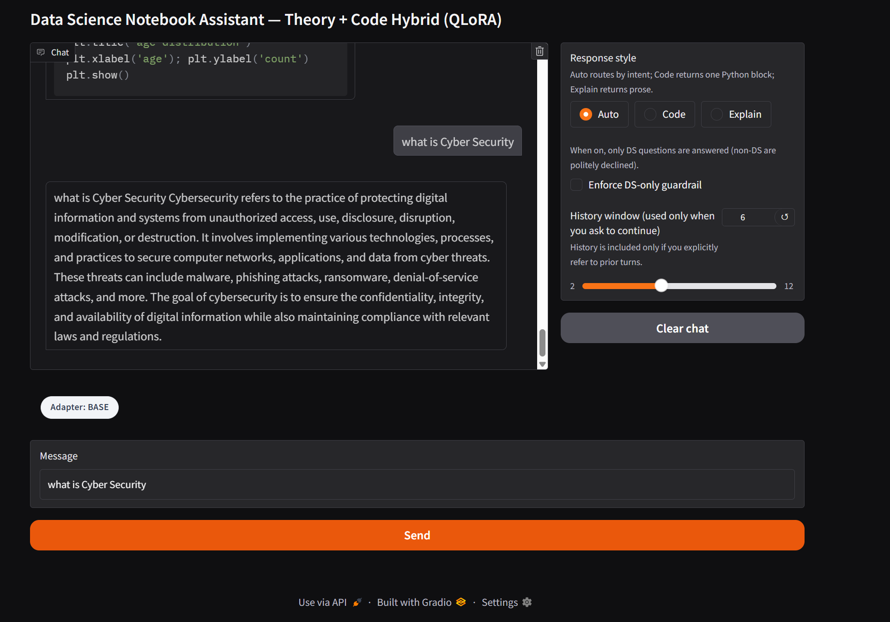
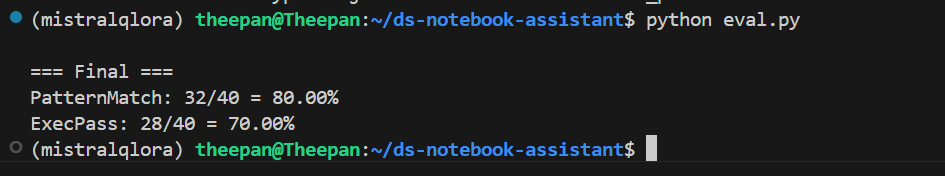

# Data Science Notebook Assistant — Theory + Code Hybrid (QLoRA)

A dual-adapter AI assistant built on **Mistral-7B (4-bit)**, fine-tuned with **QLoRA** for two specializations:  
- **Code Adapter** → Generates clean, runnable Python for Data Science tasks  
- **Theory Adapter** → Produces concise, accurate Data Science explanations  

Includes an intelligent router, output cleaner, DS-only guardrail, and a **live adapter status chip** in the Gradio UI.


---

##  Project Objective
To create a context-aware, multi-brain AI assistant for Data Science workflows that seamlessly switches between **theory** and **code** generation modes, improving accuracy and output quality.

A Gradio app routes requests (Auto / Code / Explain), has **DS guardrails**, **context-on-demand memory**, **clean output sanitizers**, and a **live adapter status chip** (CODE / THEORY / BASE / GUARDED).

---


##  Architecture

```mermaid
flowchart TB
    U[User Prompt] --> R[Router: Detect Mode (Auto/Code/Explain) + DS Topic Check]
    R -- DS + Code --> A1[LoRA Code Adapter]
    R -- DS + Explain --> A2[LoRA Theory Adapter]
    R -- Non-DS or Guard OFF --> B[Base Model: Mistral-7B 4-bit]
    A1 --> G[Generator]
    A2 --> G
    B --> G
    G --> C[Output Cleaner: Format Code / Prose]
    C --> UI[Gradio UI with Status Chip]
```

## Flow in Steps
1. **User Prompt** – User asks a question (e.g., "What is cross-validation?" or "Plot histogram").
2. **Router** – Detects topic + user-selected mode (Auto, Code, Explain) and decides which model adapter to use.
3. **Model Selection** – Mistral-7B (4-bit) with:
   - LoRA Code Adapter → for clean runnable Python code
   - LoRA Theory Adapter → for short, clear DS explanations
   - Base model → if guardrail is off or non-DS
4. **Generation** – The chosen model generates the raw answer.
5. **Output Cleaner** – Removes prompt echoes and formats code/theory output cleanly.
6. **UI (Gradio)** – Displays final cleaned output + status chip showing which adapter was used.

##  Project Structure

```
├─ data/
│  ├─ train.jsonl              # code dataset
│  ├─ eval.jsonl
│  ├─ train_theory.jsonl       # theory dataset
│  ├─ eval_theory.jsonl
├─ output/                     # code adapter checkpoints
│  └─ adapters/                # final LoRA weights (code)
├─ output_theory/              # theory adapter checkpoints
│  └─ adapters/                # final LoRA weights (theory)
├─ Screenshots/                # for README images
│  ├─ langing_page.png
│  ├─ code_output.png
│  ├─ theory_output.png
│  ├─ base_output.png
├─ app_memory.py               # Gradio app (routing, guardrails, cleaners, status chip)
├─ train_code.py               # (renamed) code adapter training
├─ train_theory.py             # theory adapter training
├─ eval.py                     # metrics harness (PatternMatch%, ExecPass%)
└─ README.md

```


##  Screenshots

**Landing Page**  


**code Output**


**Base Model Output**


**Model Result Output**


## Datasets & format
{"messages": [
  {"role": "system", "content": "... (clean system rule) ..."},
  {"role": "user", "content": "prompt"},
  {"role": "assistant", "content": "desired answer (code block or theory prose)"}
]}

## Setup Instructions

**Clone the repository**

```bash
git clone https://github.com/yourusername/ds-notebook-assistant.git
cd ds-notebook-assistant
```

**Install dependencies**
```bash
pip install -r requirements.txt
```

**Fine-tune adapters**
```bash
python train.py          
python train_theory.py   
```
**Run the app**
```bash
python app_memory.py
```

## Future Enhancements

-Dataset expansion to 5–6k examples per adapter

-Multi-adapter hot-swap in UI

-Support for multi-language Data Science questions

#### License

This project is licensed under the MIT License.


